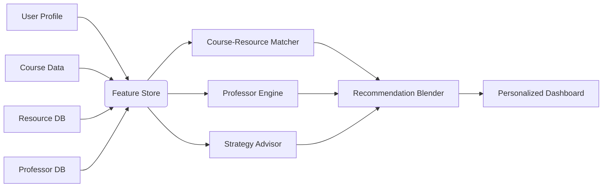

#### Core Recommendation Systems:
1. **Course-Resource Matcher**  
   - *Inputs*:  
     - Course descriptions/syllabi (text)  
     - User's academic history  
     - Resource metadata (textbooks, videos, study guides)  
   - *Architecture*:  
     - **Dual-Text Transformer Encoders**  
       - Course encoder: BERT-based model processing syllabus text  
       - Resource encoder: Same architecture processing resource descriptions  
     - **Cross-Attention Layer**:  
       - Learns semantic relationships between course concepts and resource content  
     - *Output*: Relevance scores (0-1) for resources  

2. **Professor Compatibility Engine**  
   - *Inputs*:  
     - Teaching style tags (lecture-heavy, project-based, etc.)  
     - Grade distributions from historical data  
     - Student reviews (NLP processed)  
     - User's learning preferences  
   - *Architecture*:  
     - **Multi-Modal Fusion Model**  
       - Structured data pipeline (grading patterns, pass rates)  
       - NLP pipeline (sentiment analysis of reviews)  
       - Preference matching network  
     - **Graph Neural Network (GNN)**:  
       - Nodes: Professors, Courses, Students  
       - Edges: Teaching relationships, enrollment history  
     - *Output*: Compatibility score + teaching style visualization  

3. **Academic Strategy Advisor**  
   - *Inputs*:  
     - Current course load  
     - Historical performance data  
     - Time commitment estimates  
     - University-specific academic calendars  
   - *Architecture*:  
     - **Temporal Convolutional Network (TCN)**:  
       - Models workload distribution across semester  
       - Predicts high-stress periods  
     - **Reinforcement Learning Agent**:  
       - Environment: Simulated semester timeline  
       - Rewards: Balanced workload, optimal grades  
       - Actions: Study schedule adjustments  
     - *Output*: Weekly action plan with risk alerts  

#### Integration Framework:

#### Data Flow:
1. **Feature Engineering Layer**:  
   - Syllabus parsing → concept embeddings  
   - Review sentiment → teaching style vectors  
   - Grade distributions → difficulty coefficients  

2. **Model Training**:  
   - **Transfer Learning**: Pre-trained on general academic datasets  
   - **University-Specific Fine-tuning**: Adapts to institutional nuances  
   - **Bias Mitigation**: Fairness constraints in professor recommendations  

3. **Real-Time Serving**:  
   - Lightweight ONNX models for mobile latency  
   - Contextual bandits for exploratory recommendations  

#### Advanced Components:
- **Knowledge Graph**:  
  - Connects courses → prerequisites → professors → resources  
  - Enables explainable recommendations ("Recommended because you excelled in X")  

- **Cold Start Solution**:  
  - Cluster-based profiling for new users  
  - Zero-shot learning from course descriptions  

- **Continuous Learning**:  
  - Feedback loops from user engagement  
  - Semester-end performance recalibration  

#### Performance Metrics:
- **Resource Matcher**: NDCG@5 (ranking quality)  
- **Professor Engine**: MAP@K (precision in top-K matches)  
- **Strategy Advisor**: Stress prediction AUC  

Would you like to:  
1. Explore the professor compatibility GNN in more depth?  
2. Discuss how to handle data privacy for academic records?  
3. See how to prioritize features for MVP development?