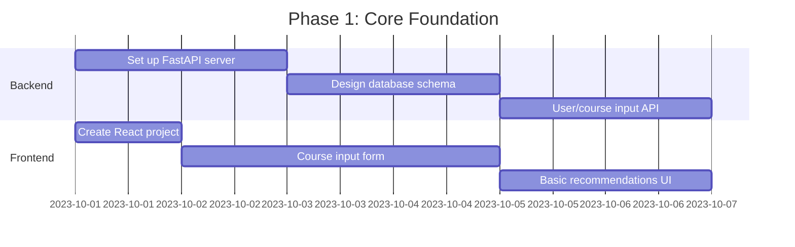
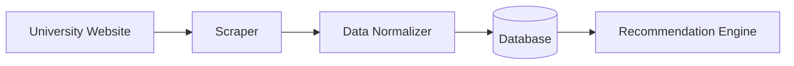
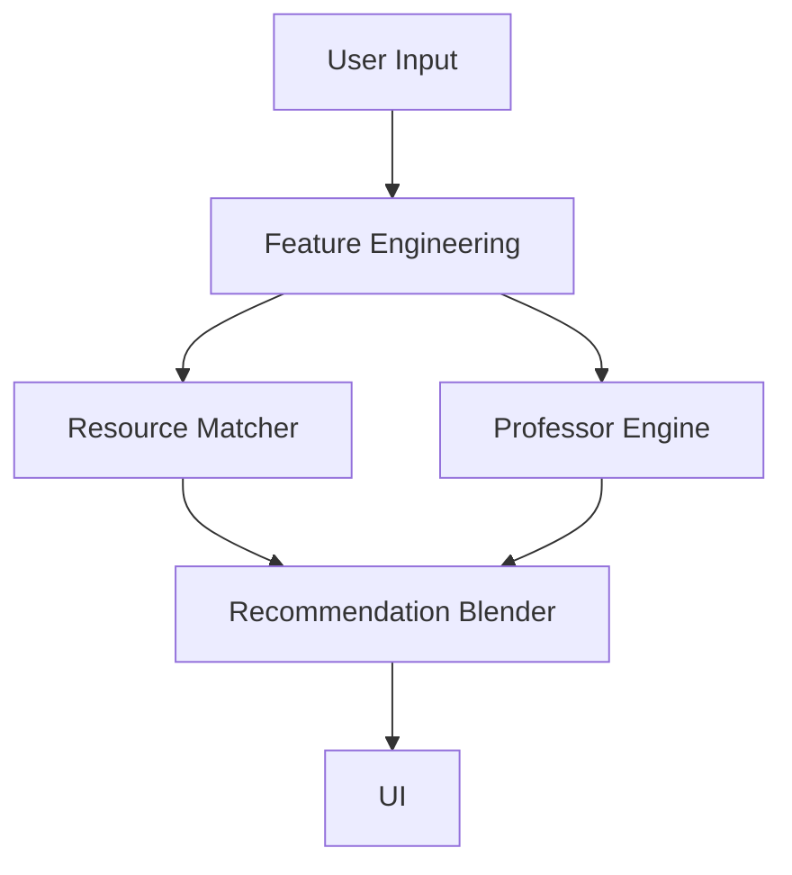
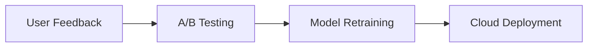

Here's a prioritized roadmap to build your academic recommendation application, focusing on **MVP development first**. I'll break it down into actionable phases with time estimates:

### Phase 1: Core Foundation (Week 1-2)
**Goal**: Basic working prototype with manual recommendations


**Key Tasks**:
1. Set up Python backend with FastAPI
2. Design database schema (SQLite for MVP):
   ```python
   # Sample Schema
   courses (id, code, title, description)
   professors (id, name, department, teaching_style)
   users (id, name, preferences)
   user_courses (user_id, course_id, professor_id)
   resources (id, course_id, type, url)
   ```
3. Build frontend course input form (React + TailwindCSS)
4. Create mock recommendation logic:
   - Hardcoded resource lists per course
   - Static professor matching rules
   - Basic workload calculator

### Phase 2: Data Pipeline (Week 3)
**Goal**: Automate course/professor data ingestion


**Key Tasks**:
1. Build web scrapers for:
   - Course catalogs (BeautifulSoup)
   - Professor info (RateMyProfessor API alternative)
2. Create data normalization scripts
3. Develop admin dashboard for data management
4. Implement basic search functionality

### Phase 3: ML Foundations (Week 4-5)
**Goal**: Implement core recommendation systems


**Key Tasks**:
1. **Resource Matcher**:
   - Syllabus → keyword extraction (spaCy)
   - TF-IDF similarity matching
   - Manual tagging system (MVP)

2. **Professor Engine**:
   - Rule-based compatibility scoring
   - Sentiment analysis of reviews (TextBlob)
   - Teaching style classification

3. **Workload Predictor**:
   - Simple time estimation algorithm
   - Conflict detection

### Phase 4: Production Refinement (Week 6-8)
**Goal**: Polish and scale the application


**Key Tasks**:
1. User authentication (OAuth2)
2. Recommendation personalization
3. Performance optimization
4. Cloud deployment (AWS/Azure free tier)
5. Basic mobile responsiveness

### Phase 5: Advanced ML (Post-MVP)
**Goal**: Intelligent recommendations
1. Transformer models for syllabus analysis
2. GNNs for professor compatibility
3. Predictive workload modeling
4. Degree pathway optimization

---

### What to Build RIGHT NOW (Day 1)
1. **Backend Setup**:
   ```bash
   # Create virtual environment
   python -m venv edumatch-env
   source edumatch-env/bin/activate

   # Install dependencies
   pip install fastapi uvicorn sqlite
   ```

2. **Core API Structure** (`main.py`):
   ```python
   from fastapi import FastAPI

   app = FastAPI()

   # MVP Database (in-memory)
   courses_db = [
       {"id": 1, "code": "CS101", "title": "Intro to Programming"},
       {"id": 2, "code": "MATH201", "title": "Calculus I"}
   ]

   @app.post("/submit-courses")
   async def submit_courses(user_courses: list):
       # MVP: Just store in memory
       return {"message": "Courses submitted", "data": user_courses}

   @app.get("/recommendations/{user_id}")
   async def get_recommendations(user_id: int):
       # MVP: Static recommendations
       return {
           "resources": ["CS101 Textbook.pdf", "MATH201 Practice Problems"],
           "professor_tip": "Dr. Smith for CS101 - great for beginners",
           "workload_warning": "Heavy workload detected in weeks 8-10"
       }
   ```

3. **Frontend Starter**:
   ```bash
   npx create-next-app@latest frontend
   cd frontend
   npm run dev
   ```
   Create basic course input form in `pages/index.js`

---

### Progression Strategy
1. **Daily Goal Setting**:
   - Day 1: API accepts courses → returns hardcoded response
   - Day 2: Basic React form connects to API
   - Day 3: Persistent SQLite storage
   - Day 4: Scrape 1 university's course data
   - Day 5: Display real course resources

2. **Avoid Premature Optimization**:
   - Use SQLite → PostgreSQL later
   - Start with TF-IDF → upgrade to transformers
   - Manual professor tags → NLP later

3. **Validation Milestones**:
   - Week 1: 3 users can submit/get recommendations
   - Week 2: Supports 2 universities
   - Week 4: Personalized suggestions

---

### Tools to Install Immediately
1. **Backend**:
   - Python 3.10+
   - FastAPI
   - SQLAlchemy
   - BeautifulSoup (scraping)

2. **Frontend**:
   - Node.js 18+
   - Next.js 13
   - Tailwind CSS
   - Axios (API calls)

3. **DevOps**:
   - Docker
   - Git
   - VS Code with Python/ESLint extensions

Start with the **API endpoint for course submission** and **basic React form** - this creates immediate visible progress. Would you like me to provide the complete starter code for Day 1 implementation?