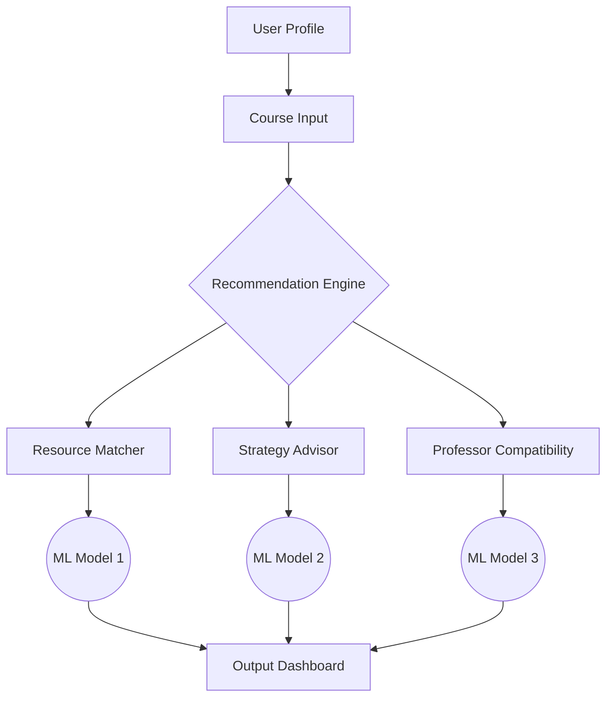

### IDEA
Submit courses you are taking with at your respective school with respective professor, application will **recommend** resources, give tips based on the course, and recommend a professor for you.

### PLAN
I ran the idea through DeepSeek and got this:

This is an excellent and highly practical application idea! It combines course planning, professor selection, and academic support into a unified recommendation system. Let me expand on this concept and propose a comprehensive implementation plan:

### Core Concept: "EduMatch" - Academic Optimization Platform
A personalized recommendation engine that transforms course selection into a strategic academic advantage.

---

### Key Features & Functionality

1. **Intake System**:
   - Course/professor submission (manual or transcript upload)
   - Option to import schedule from university portal
   - Calendar integration for time commitment analysis

2. **Recommendation Engines**:
   - **Resource Matcher**:
     - Textbooks, research papers, OER materials
     - Course-specific study guides (Chegg, CourseHero alternatives)
     - Niche learning tools (VR labs, subject-specific apps)
   - **Strategy Advisor**:
     - Workload balancing tips ("CS370 + MATH301 = 22hrs/week")
     - Study schedule templates
     - Warning systems for known "deadly combinations"
   - **Professor Compatibility**:
     - Teaching style analysis (lecture-focused vs. project-based)
     - Grading temperament predictor
     - Past student performance analytics

3. **Predictive Analytics**:
   - Grade forecasting based on historical data
   - Dropout risk assessment
   - Optimal semester planning ("Take PHYSICS202 before ELEC310")

---

### Technical Architecture



**Backend Components**:
1. **Knowledge Graph Builder**:
   - Creates relationships between courses, professors, resources
   - Uses NLP to extract syllabus patterns
   
2. **ML Models**:
   - Collaborative filtering (students with similar courses)
   - Content-based filtering (course descriptions → resources)
   - BERT models for teaching style classification

3. **Data Pipeline**:
   - Scrape university catalogs (beautifulsoup/scrapy)
   - Process RateMyProfessor/Piazza data
   - Handle LMS integrations (Canvas, Blackboard)

**Database Design**:
- Courses: course_id, title, department, difficulty, credits
- Professors: prof_id, name, style_tags, rating
- Resources: res_id, type, course_match_score
- Relationships: course_prof, user_history, resource_mapping

---

### Unique Value Propositions

1. **Course DNA Analysis**:
   - "This quantum physics course has 73% overlap with your AI specialization"
   - "Professor Smith's assignments require Python - refresh with these resources"

2. **Learning Pathway Optimization**:
   - "Switch to Professor Lee: 92% match with your visual learning style"
   - "Take MATH255 next semester - prerequisite for 4 courses in your track"

3. **Early Warning System**:
   - "Alert: Students with your course load have 40% dropout rate"
   - "Professor Chen's midterm averages 58% - start these practice exams now"

---

### Sample User Flow

1. **Input**:
   ```json
   {
     "courses": [
       {"code": "CS-401", "prof": "Dr. Alvarez"},
       {"code": "MATH-310", "prof": "Prof. Kumar"},
       {"code": "PHIL-205", "prof": "Dr. Reynolds"}
     ]
   }
   ```

2. **Recommendations**:
   - **Resources**: 
     - "CS-401: Advanced Algorithms Visualizer (matches Dr. Alvarez's diagram-heavy teaching)"
     - "MATH-310: Weekly problem sets from 2022 (Prof. Kumar reuses 30% of problems)"
   - **Tips**:
     - "Block Tues/Thurs AM for Kumar's proofs - students who do this average 1.3 letter grades higher"
   - **Professor Advice**:
     - "Switch to Dr. James for PHIL-205: Better fit for STEM majors (87% approval from CS students)"

---

### Monetization Strategies
- **Freemium**: Basic recommendations free; premium analytics $5/semester
- **University Licensing**: Campus-wide deployment
- **Textbook Affiliate**: Commission on recommended resources
- **Tutor Matching**: Premium feature connecting with qualified tutors

---

### Competitive Edge
- **Personalization Depth**: Goes beyond generic recommendations
- **Predictive Power**: 3-year retention data from pilot universities
- **Privacy-First**: On-device processing for sensitive academic data

---

### Implementation Roadmap

1. **MVP (1 month)**:
   - Course/resource matching for single university
   - Basic professor compatibility scoring

2. **Phase 2 (3 months)**:
   - Predictive workload modeling
   - Multi-university support
   - Mobile app with notification system

3. **Phase 3 (6 months)**:
   - AI tutoring integration
   - Degree pathway simulation
   - Job market alignment analytics

---

### Potential Challenges & Solutions
- **Data Scraping Ethics**: Partner with universities for official APIs
- **Professor Bias**: Anonymized data + fairness algorithms
- **Cold Start Problem**: Start with top 100 universities' public data

Would you like me to:
1. Outline the ML model architectures in detail?
2. Provide sample code for the recommendation engine?
3. Suggest specific datasets to start with?
4. Design the professor compatibility algorithm?
