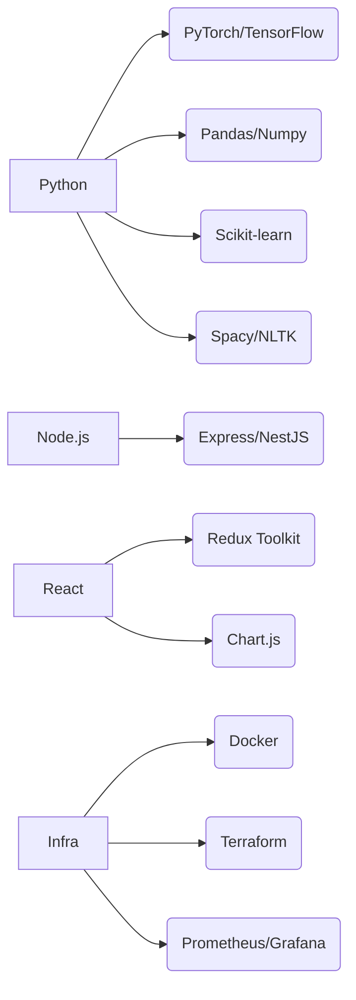
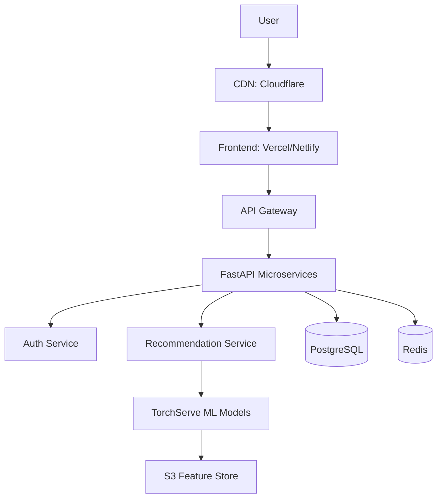

Here's a battle-tested tech stack for your academic recommendation application, optimized for scalability and ML integration:

### **Core Tech Stack**
| **Layer**               | **Recommendations**                                                                 | **Why**                                                                 |
|--------------------------|-------------------------------------------------------------------------------------|--------------------------------------------------------------------------|
| **Backend Framework**    | Python (FastAPI) or Node.js (NestJS)                                                | Async support, lightweight, perfect for ML integration                  |
| **Frontend**             | React (Next.js) + TypeScript                                                        | Server-side rendering, static site optimization                          |
| **Database**             | PostgreSQL (relational) + Redis (caching)                                           | JSONB support for unstructured data, ACID compliance                    |
| **ML Serving**           | Python (PyTorch/TensorFlow) + ONNX Runtime                                          | Model optimization for production                                       |
| **Cloud Infrastructure** | AWS (SageMaker/EC2) or GCP (Vertex AI)                                              | Managed ML services, auto-scaling                                       |
| **Containerization**     | Docker + Kubernetes (EKS/GKE)                                                       | Consistent deployments, scaling                                         |

---

### **Specialized Components**
1. **Data Pipeline**:
   - **Scraping**: Python (Beautiful Soup, Scrapy)
   - **ETL**: Apache Airflow (Python)
   - **Data Lake**: AWS S3 / Google Cloud Storage

2. **Recommendation Engines**:
   - **Resource Matcher**: Python (sentence-transformers, FAISS)
   - **Professor GNN**: PyTorch Geometric (Python)
   - **Workload Predictor**: Prophet or PyTorch TCN (Python)

3. **APIs & Integrations**:
   - **University Systems**: OAuth2, LTI (Learning Tools Interoperability)
   - **Calendar Sync**: Google Calendar API / Outlook Graph API

---

### **Key Libraries & Tools**

---

### **MVP vs. Production Stack**
| **Component**       | **MVP**                          | **Production**                     |
|---------------------|----------------------------------|------------------------------------|
| **Backend**         | Flask + SQLite                   | FastAPI + PostgreSQL + Redis       |
| **ML Serving**      | Local PyTorch models             | TorchServe + ONNX + Kubernetes     |
| **Deployment**      | Heroku/Vercel                    | AWS ECS/EKS with auto-scaling      |
| **Monitoring**      | Print logs                       | Prometheus + Grafana + Sentry      |
| **Data Processing** | Pandas in-memory                 | Spark/Dask on EMR/Databricks       |

---

### **Critical Python Libraries**
1. **NLP Processing**:
   - `sentence-transformers` (resource matching)
   - `spaCy` (syllabus parsing)
2. **ML Frameworks**:
   - `PyTorch` (professor GNNs)
   - `XGBoost` (grade prediction)
3. **Utils**:
   - `FastAPI` (async endpoints)
   - `SQLAlchemy` (DB ORM)
   - `Celery` (background tasks)

---

### **JavaScript/TypeScript Essentials**
1. **Frontend**:
   - `Next.js` (SSR/SSG)
   - `TanStack Query` (data fetching)
2. **Visualization**:
   - `D3.js` (workload timelines)
   - `React Flow` (course dependency graphs)

---

### **Deployment Architecture**

---

### **Learning Roadmap**
1. **Priority 1**:
   - Python + FastAPI (backend)
   - React + TypeScript (frontend)
   - PostgreSQL fundamentals
2. **Priority 2**:
   - PyTorch basics
   - Transformer models (Hugging Face)
   - Vector databases (FAISS/Weaviate)
3. **Priority 3**:
   - Kubernetes concepts
   - Cloud deployment (AWS/GCP)
   - MLOps tools (MLflow, DVC)

---

### **Cost Optimization Tips**
- Use `SQLite` for MVP → Upgrade to PostgreSQL
- Start with CPU-based ML → GPU only for training
- Cache aggressively with Redis
- Use serverless (AWS Lambda) for batch processing

This stack balances cutting-edge capabilities with maintainability. Start with the **Python/Node + React** core, then layer in ML and cloud services as you validate the concept. Want me to prioritize which components to build first?